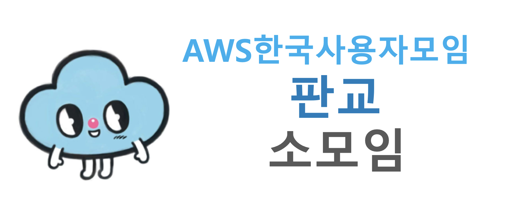

# AWSKRUG 판교 소모임

## 공지사항
### 모임 정보
- 장소 : 경기 성남시 분당구 판교로256번길 7 넥슨코리아
- 일시 : 매월 2째주 수요일
- 참가비 : 5000원
- 모임 내용 : AWSKRUG 판교 소모임에서는 AWS와 클라우드, 컨테이너, 자동화 등 다양한 분야에 대해 자유롭게 공유하는 모임이 되고자 합니다.
- 참가 방법 : [meetup](https://www.meetup.com/ko-KR/awskrug)을 통해 공지

## 2019년
- 3차: [2019년 4월 10일](meetups/20190410_meetup.md)
- 2차: [2019년 3월 13일](meetups/20190313_meetup.md)
- 1차: [2019년 2월 13일](meetups/20190213_meetup.md)

## 2017년
- 2차: [2017년 2월 9일](https://github.com/awskrug/meetups/blob/master/Pangyo-Group.md#%ED%8C%90%EA%B5%90-%EC%A4%91%EA%B8%89%EC%9E%90-%EB%AA%A8%EC%9E%84)
- 1차: [2017년 1월 6일](https://github.com/awskrug/meetups/blob/master/Pangyo-Group.md#%ED%8C%90%EA%B5%90-%EC%A4%91%EA%B8%89%EC%9E%90-%EB%AA%A8%EC%9E%84)

## 2016년
- 1차 : [2016년 12월 8일](https://www.meetup.com/ko-KR/awskrug/events/237355577/)