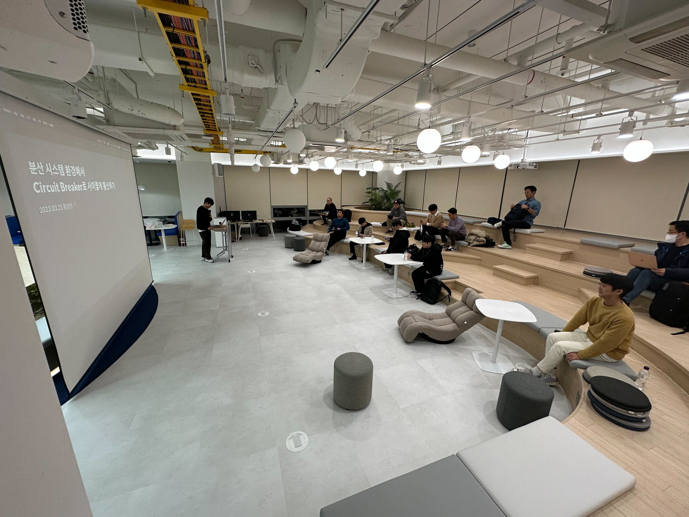
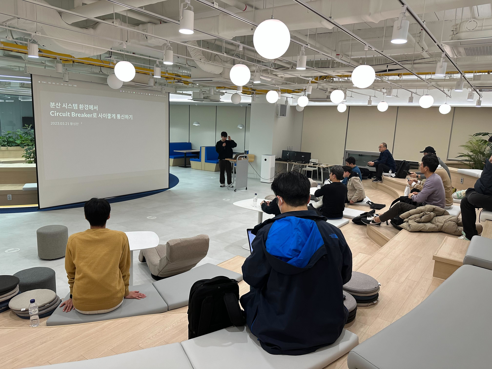

# AWSKRUG 판교 소모임

## 공지사항
### 모임 정보
- 장소 : [구름스퀘어](https://goorm-square.oopy.io/) (경기 성남시 분당구 판교로 242 A동 902호)
- 일시 : 매월 3번째 화요일
- 참가비 : 6000원
- 모임 내용 : AWSKRUG 판교 소모임에서는 AWS와 클라우드, 컨테이너, 자동화 등 다양한 분야에 대해 자유롭게 공유하는 모임이 되고자 합니다.
- 참가 방법 : [meetup](https://www.meetup.com/ko-KR/awskrug)을 통해 공지

## 2023년
### 2023년 6월 20일
[meetup 링크](https://www.meetup.com/ko-KR/awskrug/events/294013867/)  
[AWS & Telepresence 를 이용하여 편리한 개발 환경 구성하기 - 윤상현](https://docs.google.com/presentation/d/1sbDeGQ0whx81XpIB55LkeOxLqa0n9422nJXl784N8Do/edit?usp=drive_link)  
**사진이 없습니다 ㅠㅠ**

### 2023년 4월 18일
[meetup 링크](https://www.meetup.com/ko-KR/awskrug/events/292820455/)  
나의 작은 Thanos monitoring system - 정승호  

### 2023년 3월 21일
[meetup 링크](https://www.meetup.com/ko-KR/awskrug/events/292066382/)
[Circuit Breaker로 사이좋게 통신하기 - 황성찬](attachments/2023/0321/2023_03_21_pangyo_circuit_breaker.pdf)

### 2023년 2월 21일
[meetuup 링크](https://www.meetup.com/ko-KR/awskrug/events/291455354/)  
[어쩌다 보니 AWS 인프라 구축 (부제: 신규 서비스 개발을 위한 설계 고민들) - 안정수](attachments%2F2023%2F0221%2F%EC%96%B4%EC%A9%8C%EB%8B%A4%20AWS%20%EC%9D%B8%ED%94%84%EB%9D%BC%20%EA%B5%AC%EC%B6%95%28%EC%8B%A0%EA%B7%9C%20%EC%84%9C%EB%B9%84%EC%8A%A4%20%EA%B0%9C%EB%B0%9C%EC%9D%84%20%EC%9C%84%ED%95%9C%20%EC%84%A4%EA%B3%84%20%EA%B3%A0%EB%AF%BC%EB%93%A4%29.pdf)  

### 2023년 1월 17일
[meetuup 링크](https://www.meetup.com/ko-KR/awskrug/events/290666214/)  
[서버 가상화와 컨테이너의 이해 - 이병호](attachments%2F2023%2F0117%2F%EC%84%9C%EB%B2%84%20%EA%B0%80%EC%84%B1%ED%99%94%EC%99%80%20%EC%BB%A8%ED%85%8C%EC%9D%B4%EB%84%88%EC%9D%98%20%EC%9D%B4%ED%95%B4_%EC%9D%B4%EB%B3%91%ED%98%B8.pdf)  
차세대 앱은 이벤트 드리븐 아키텍쳐와 함께 - 김태웅(직방) [저작권 문제로 발표자료 공유 불가]  

## 2022년
### 2022년 12월 17일
[meetup 링크](https://www.meetup.com/ko-KR/awskrug/events/290054105/)  
[ArgoCD + Kustomize 로 Kubernetes 에 GitOps 적용하기 - 윤상현(넥슨코리아)](https://hinco114.notion.site/221208-291b5a05a07d4f15849276d2fca6c2d7)  
[Golang으로 API Gateway + Lambda 쉽게 쓰기 - 이재성(스톡폴리오)](https://slides.hellp.io/%EB%A7%88%EB%A5%B8%EC%88%98%EA%B1%B4%EC%A7%9C%EA%B8%B0.slide#1)  

## 2019년
회비 정산 : [2019년 판교 소모임 회비 정산](https://drive.google.com/file/d/1iELIGAcESyceQGAk_NLkDTOFcTFs_XcL/view?usp=sharing)

- 5차: [2019년 6월 5일](meetups/2019/20190605_meetup.md)
- 4차: [2019년 5월 15일](meetups/2019/20190515_meetup.md)
- 3차: [2019년 4월 10일](meetups/2019/20190410_meetup.md)
- 2차: [2019년 3월 13일](meetups/2019/20190313_meetup.md)
- 1차: [2019년 2월 13일](meetups/2019/20190213_meetup.md)

## 2017년
- 2차: [2017년 2월 9일](https://github.com/awskrug/meetups/blob/master/Pangyo-Group.md#%ED%8C%90%EA%B5%90-%EC%A4%91%EA%B8%89%EC%9E%90-%EB%AA%A8%EC%9E%84)
- 1차: [2017년 1월 6일](https://github.com/awskrug/meetups/blob/master/Pangyo-Group.md#%ED%8C%90%EA%B5%90-%EC%A4%91%EA%B8%89%EC%9E%90-%EB%AA%A8%EC%9E%84)

## 2016년
- 1차 : [2016년 12월 8일](https://www.meetup.com/ko-KR/awskrug/events/237355577/)
