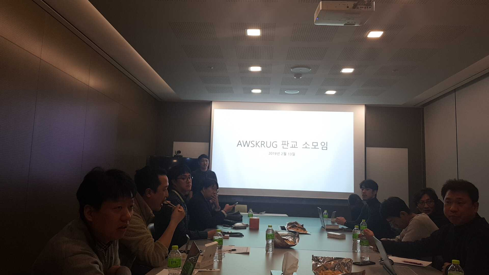
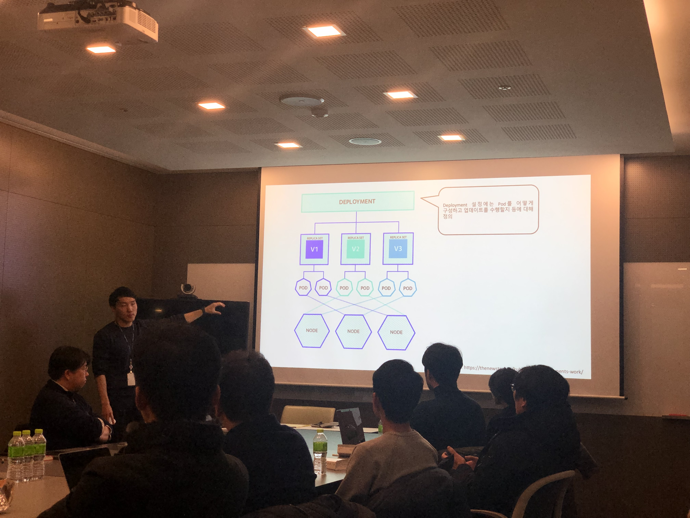

## 2019년 2월 13일
- 장소 : 넥슨 코리아
- 모임 시간 : 오후 7시 ~ 9시

### 발표 자료
- 발표 자료 : [도커와 쿠버네티스 기초 - 최용호](../../attachments/2019/docker_k8s_basic.pdf)
  - [slideshare 링크](https://www.slideshare.net/secret/3J5KWinlXVpjtm)
- 실습 자료 : [도커와 쿠버네티스 기초 실습](https://www.notion.so/yongho1037/c579f76ccd43456ca3a1d91b6160a104)

### 소모임 중 논의 내용
- 쿠버네티스의 kubectl 발음은 [큐브 컨트롤](https://github.com/kubernetes/kubernetes/blob/master/CHANGELOG-1.9.md)
- 도커 이미지 보안을 위한 추천 도구 : [harbor](https://goharbor.io/)
- AWS Console 접속 제한을 하려면 어떻게 해야 할까? ([참고](https://docs.aws.amazon.com/ko_kr/IAM/latest/UserGuide/reference_policies_examples_aws_deny-ip.html))
- 다음 모임에서 엄기성님께서 [AWS CloudFormation StackSets](https://docs.aws.amazon.com/AWSCloudFormation/latest/UserGuide/stacksets-concepts.html)에 대해 발표 예정
- 모임 시간을 오후 7시 30분으로 변경

### 모임 사진

