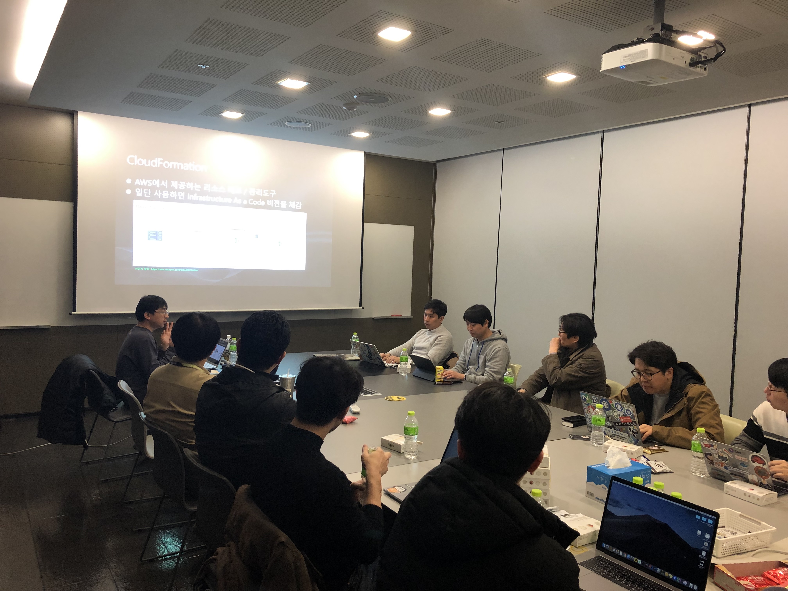

## 2019년 3월 13일
- 장소 : 넥슨 코리아
- 모임 시간 : 오후 7시 30분 ~ 9시 30분
- 회비 정산 : [2019년 3월 13일 판교 소모임 회비 정산](https://docs.google.com/spreadsheets/d/1rpmKj1jRhJ3UojXxKlVAhoOmjoeX9-6fFRRudVFwEcg/edit?usp=sharing)

### 발표 자료
- [AWS CloudFormation StackSets 활용 - 엄기성](https://github.com/giseongeom/presentations/tree/master/2019/2019.03.12-AWS-pangyo)

- [ElasticStack으로 서버 상태 체크하기 - 최용호](https://www.slideshare.net/secret/uWyH4rf0MTtIO3)
    - [실습 자료](https://goo.gl/chhKE6)

### 소모임 중 논의 내용
- Cross Account와 Cross-Region Management가 Stacksets
    - 이 기능을 테라폼과 같은 도구를 사용할 경우 굉장히 번거로운 작업이 됨
- CloudFormation을 썼을 떄의 장점은 새로운 서비스가 GA 됨과 동시에 CloudFormation에도 기능이 추가됨
- CloudFormation의 모든 단위는 스택
    - 스택은 간단히 리소스를 묶은 덩어리
- EC2 인스턴스처럼 stack에도 terminate를 방지하는 옵션이 존재하기 때문에 사용 권장
- StackSets는 Stack이 여러개라는 것을 의미
- 다수의 리전이나 다른 account로 동시에 적용할 수 있음
- 동일한 CloudFormation 스크립트 파일을 기반으로 여러 계정, 여러 리전에 동시에 동일한 환경을 구축할 수 있다는 것이 장점
- 간단한 것이라도 S3에 올려야 사용 가능
    - ACL은 Private여도 무방
- Stack에는 존재하는 Terminate Protection 기능이 StackSets에는 없음
- 단일 AWS Account에서도 StackSet 사용 가능
- terraform 에서 stackset을 생성 가능한지?
    - terraform 문서 보니까 "cloudformation stack"은 생성할 수 있는데, stackset 생성은 지원하지 않는 듯! [링크](https://www.terraform.io/docs/providers/aws/r/cloudformation_stack.html) 참고

### 모임 사진

