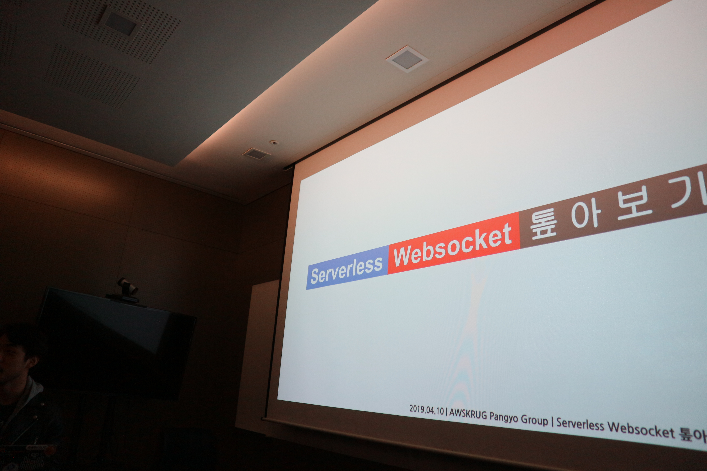
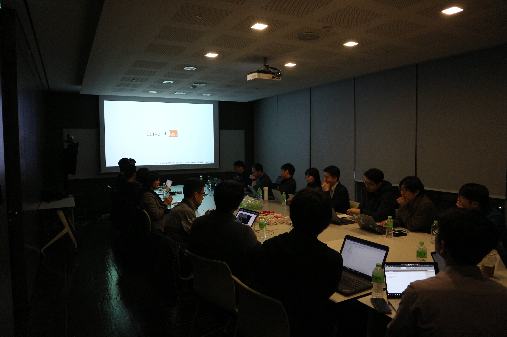
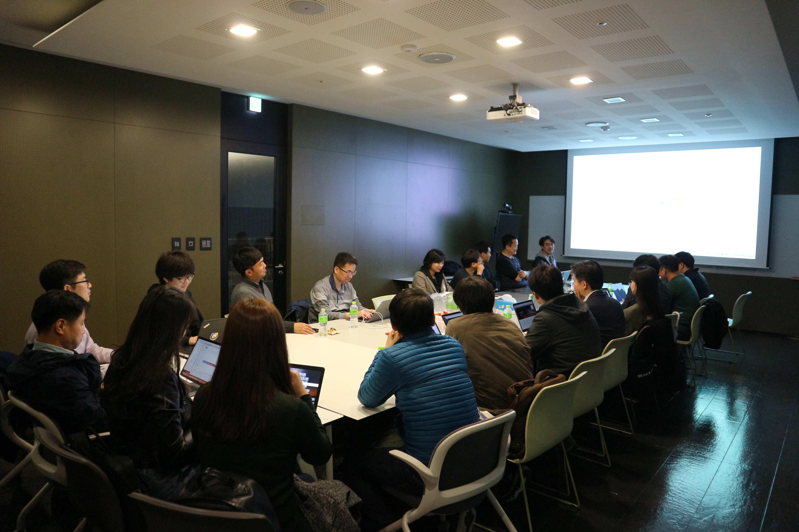
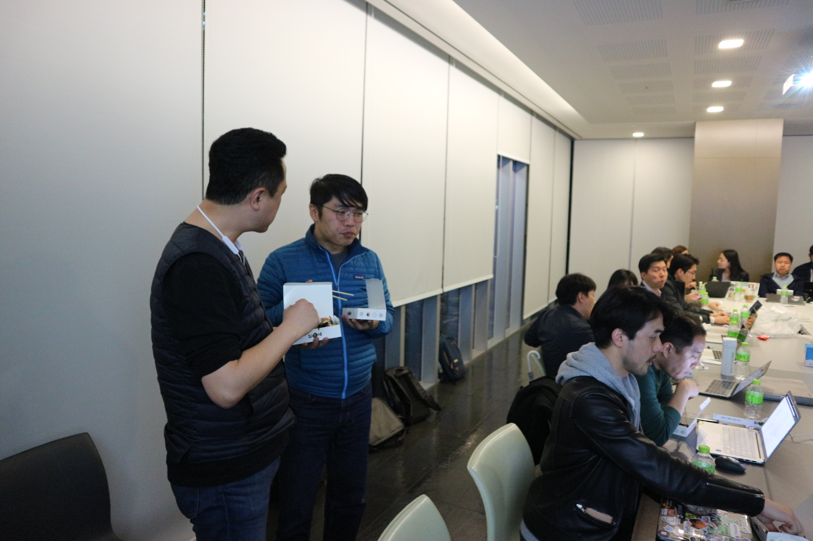
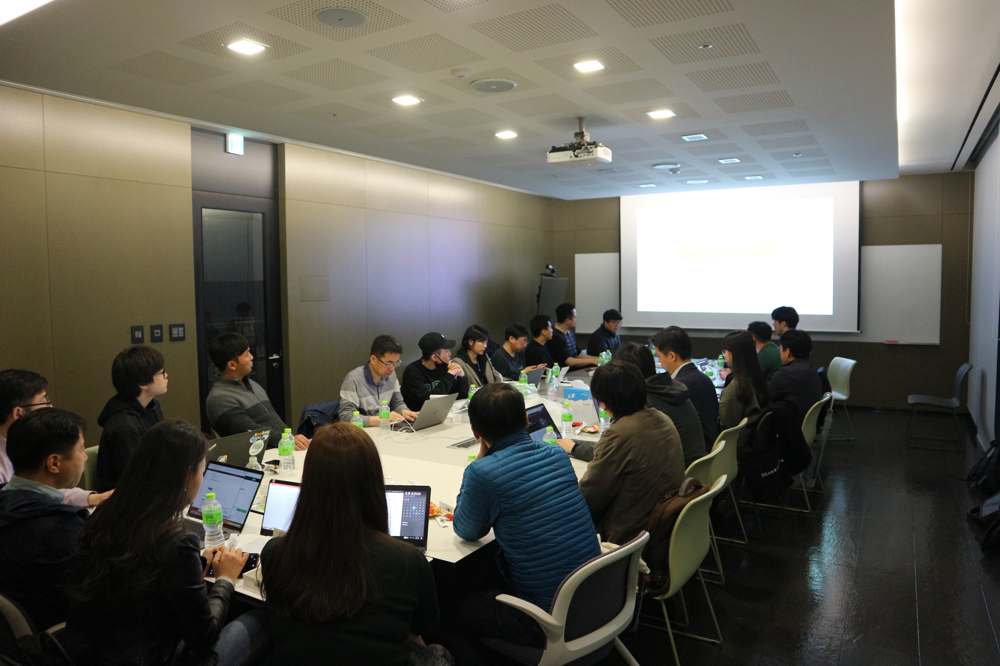
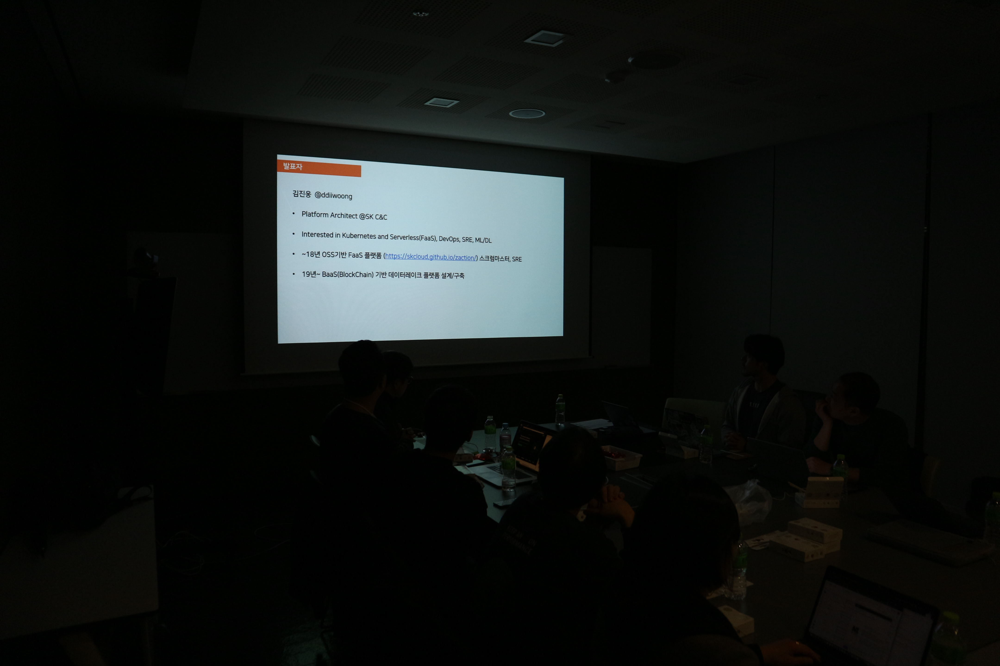

## 2019년 4월 10일
- 장소 : 넥슨 코리아
- 모임 시간 : 오후 7시 30분 ~ 9시 30분
- 회비 정산 : [2019년 4월 10일 판교 소모임 회비 정산](https://drive.google.com/file/d/1z_Blw_gv7s3GkFGjSeQqs7frXqsbrLmM/view?usp=sharing)

### 발표 자료
- [Serverless websocket 톺아보기 - 변규현](https://docs.google.com/presentation/d/1esn-lj-zBA1QO7F9kX_o9CSMusjIXKwl7XW1xQWe1y4/edit?usp=sharing)
    - [Demo 사이트](http://bit.ly/ws-sls-demo)

- [Amazon EKS Workshop 살펴보기 - 김진웅](../attachments/eksworkshop_190410.pdf)
    - [EKS Workshop을 위한 IAM json 파일](../attachments/iam_for_eksworkshop.json)
    - [김진웅님 블로그](https://ddii.dev/kubernetes/eksworkshop/)
    - [EKS Workshop](https://eksworkshop.com/?fbclid=IwAR1vSmDfzYqUzFrVV3LGiEtwBETgV-G9vxOYqu0fKnZwmVLNFACEiSLkdEw)

### 소모임 공지
- 밋업 신청 시 대기로 빠진 분들 중에 참석 가능 여쭤보시는 분들이 많아서 대기 인원분들도 수용하도록 하겠습니다.
    - 다만 소모임 공간의 테이블에 앉을 수 있는 자리가 한정적이어서 참석으로 확정 되신 분들은 테이블 자리를 제공드리고 대기로 빠지신 분들은 죄송하지만 뒤에 추가적으로 배치한 의자에 앉으실 수 있도록 제공하도록 하겠습니다.
    - 정리하면 참석이신 분들은 테이블 의자에 착석! 대기이신 분들은 뒤에 따로 배치된 의자에 착석! 
- 회비가 모임 때마다 2~3만원씩 남게 되는데 10만원이 모이면 밋업 이후 간단히 맥주 파티를 하도록 하겠습니다.
- 발표자 모집에 대한 부담이 있으실 것으로 예상되어 3번 정도만 제안 드리고 발표 지원이 없을 경우 주변에서 섭외해보도록 하겠습니다.

### 소모임 중 논의 내용
#### 서버리스 관련
- Public Cloud의 대표적인 서버리스 서비스
    - AWS Lambda
    - Azure Function
    - GCP Functions
- 서버리스 서비스는 함수만 올려두면 이벤트가 바인딩 되어서 실행되는 방식
- API Gateway를 Endpoint로 사용
    - REST API를 사용하여 트래픽을 EC2 인스턴스 또는 람다로 전달
- Serverless Application Model
    - AWS에서 공식 지원하는 모델
    - CloudFormation과 유사한 DSL의 yaml 파일
- Serverless Framework
    - SAM보다 먼저 나옴
    - 변규현님 개인적으로 추천
    - SAM 보다 DSL이 간단
    - Github Star 수가 SAM보다 월등히 많음
- Circle CI 연동해서 효과적으로 사용할 수 있음
    - Circle CI 관련 밋업을 조만간 주최 할 예정
    - CircleCI에서 Approval을 Slack 커맨드로 해결할 수 있는 기능은 아직 API가 존재하진 않지만 머지않아 추가될 것으로 예상
- Lambda에 VPC 옵션이 있어서 특정 서브넷 지정이 가능
    - 람다에서 Private 서브넷으로 접근 가능하도록 설정 할 수 있음
- 람다를 실행하기 위해 경량화된 마이크로 VM이 구동 되기 때문에 일반적인 VM 보다 부팅시간이 월등히 빠름

#### EKS 관련
- EKS에서는 VPC 대신 서드파티 네트워크 인터페이스를 사용할 수 있음 (CNI)
- EKS 워크샵은 작년 리인벤트 전에 사용자들이 쉽게 해볼 수 있는 튜토리얼로 만들게됨
- 한글화 작업도 진행 중
- EKS를 위한 준비사항
    - 프리티어는 불가능 (크레딧 필요)
    - admin 권한이 필요하지만 IAM 수정으로 User 계정으로도 가능
    - kubectl, aws-iam-athenticator, eksctl 필요
        - eksctl 준비에 10~20분정도 소요됨
        - 테라폼 사용하면 조금 더 빠르게 됨
- 쿠버네티스의 LoadBalancer는 기본적으로는 nginx
    - AWS는 ELB(ALB)
- calico(L3), cilium(L7)
- 타사 제품은 워커노드 인스턴스들이 조금씩 비싸짐
    - EKS는 마스터노드 비용이 비싸서 대용량 관리 시에는 EKS가 유리
- 주의 사항 : 김진웅님 가이드에 따라 EKS 구축시에는 수동으로 ALB를 삭제해줘야 정상적으로 CloudFormation Stack이 제거됨
    - EKS 클러스터 유지에 비용이 많이 소비되기 때문에 실습 후에 반드시 지워야함!

#### 참고 사항
- [Amazon EKS 워크샵 번역본](https://awskrug.github.io/eks-workshop/)
- [vscode의 .csv extension "Rainbow CSV"](https://marketplace.visualstudio.com/itemdetails?itemName=mechatroner.rainbow-csv)
- [들여쓰기(indent) extension #1 - "indent-rainbow"](https://marketplace.visualstudio.com/itemdetails?itemName=oderwat.indent-rainbow)
- [들여쓰기(indent) extension #2 - "indenticator"](https://marketplace.visualstudio.com/itemdetails?itemName=SirTori.indenticator)

### 모임 사진

