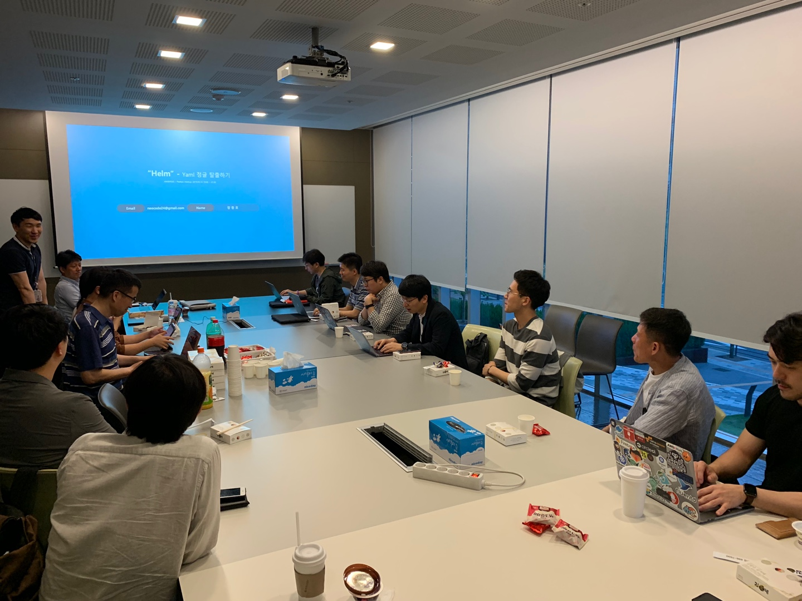
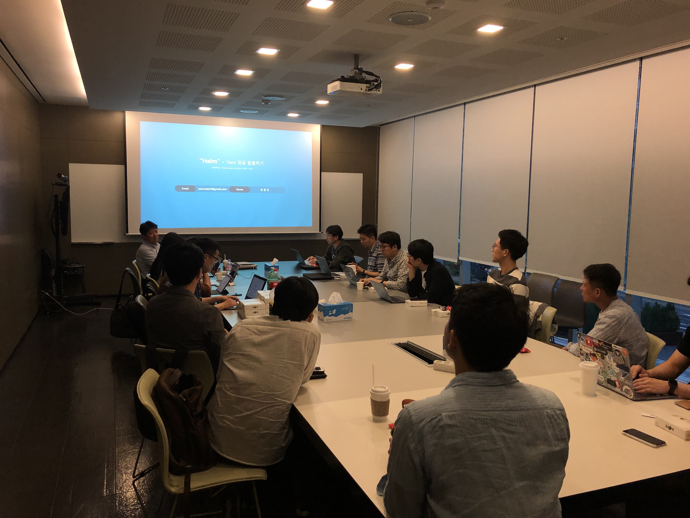
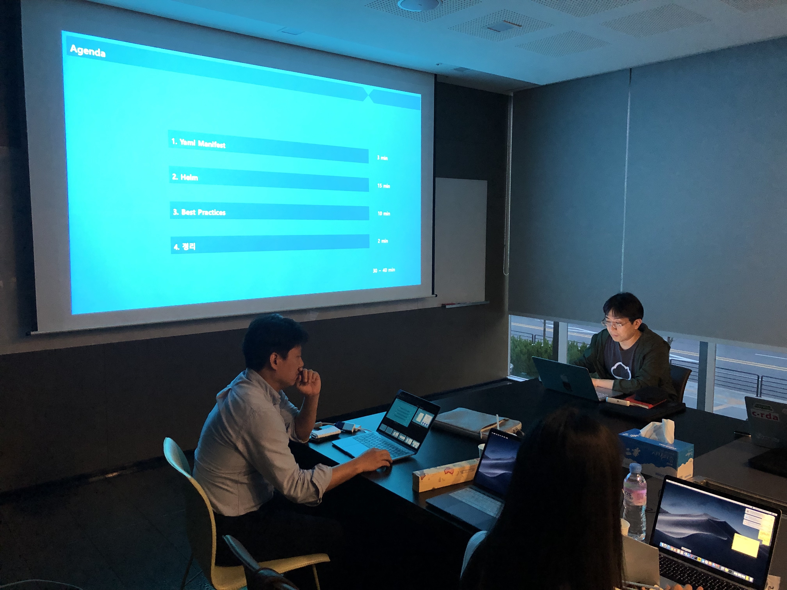
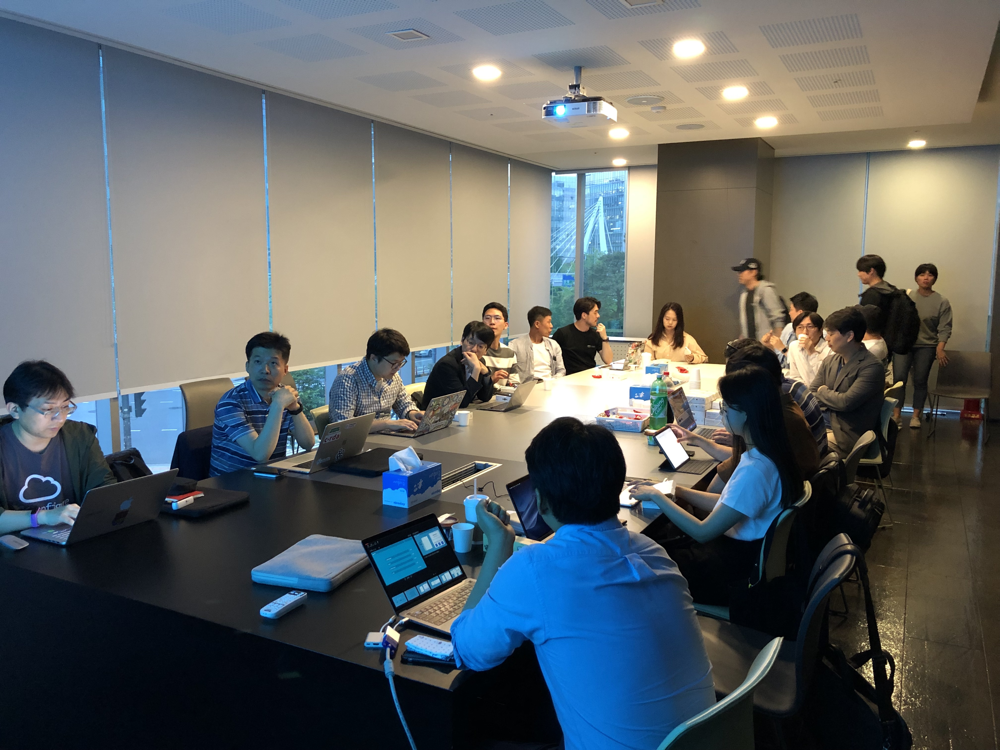
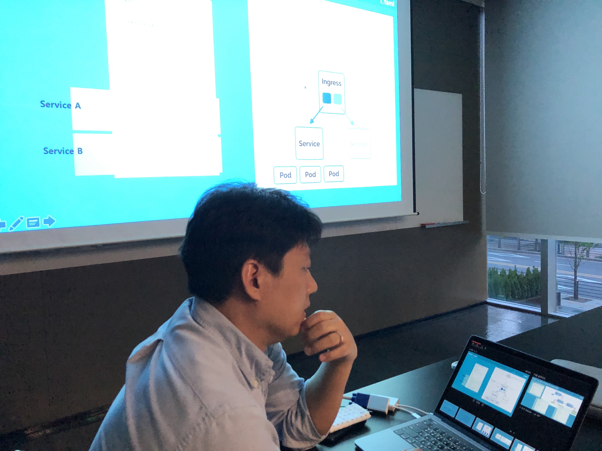
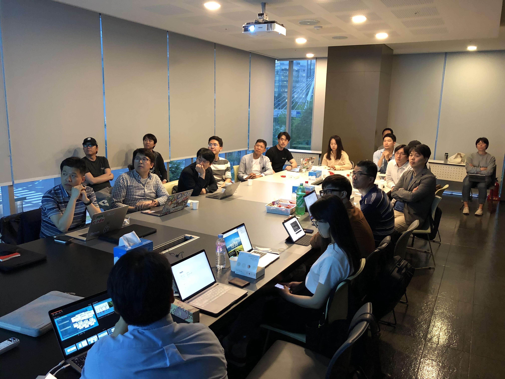
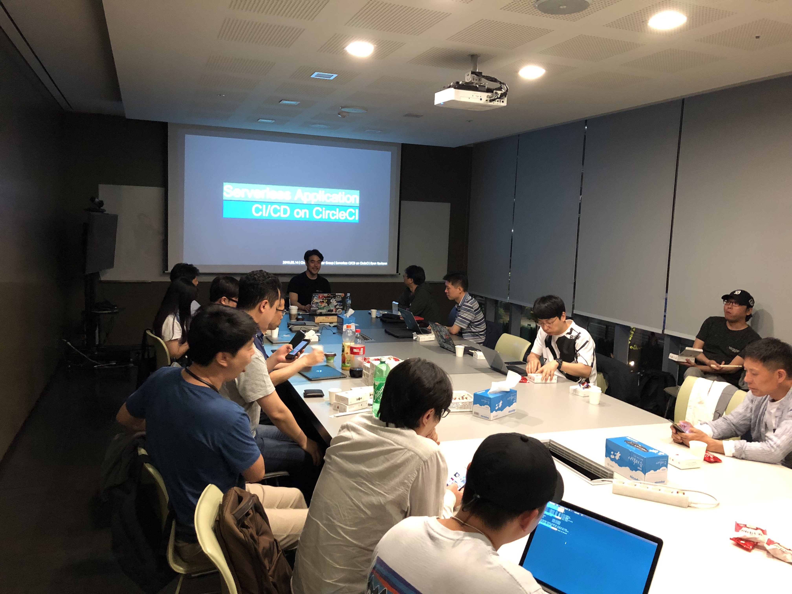
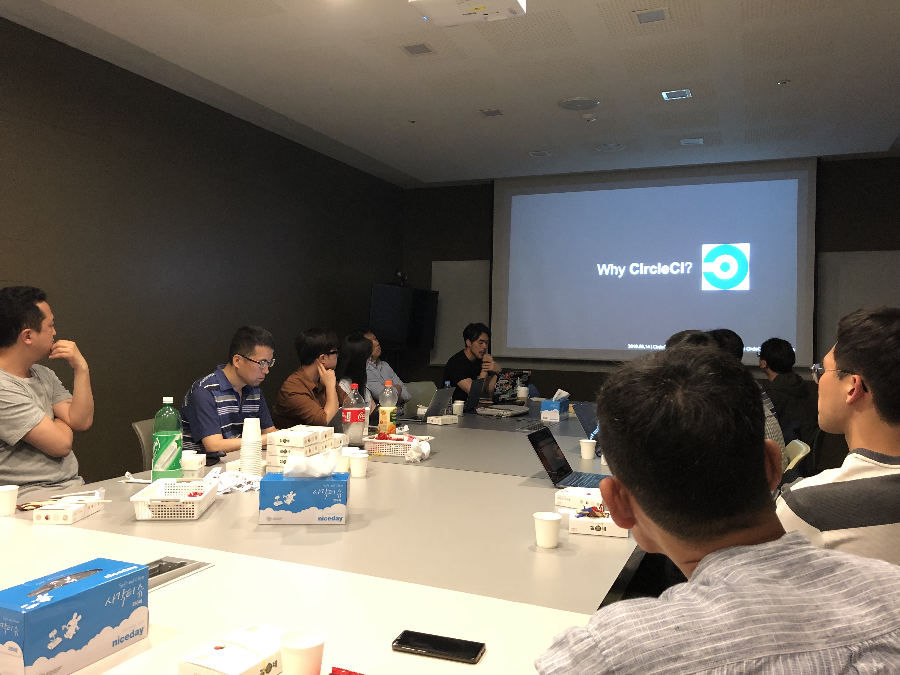
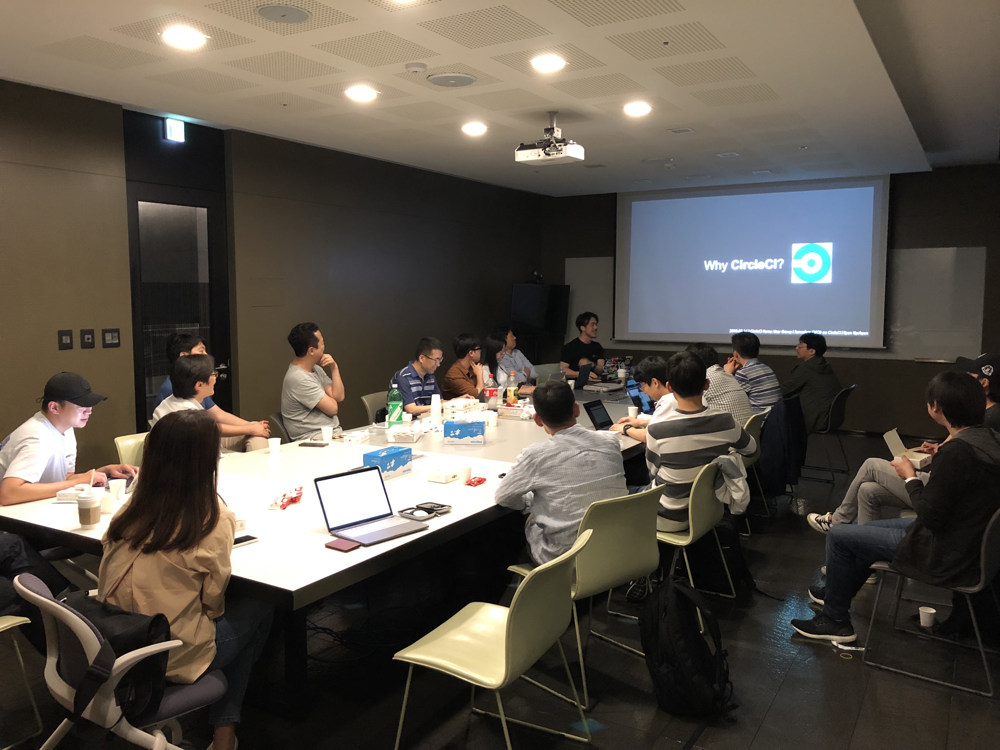
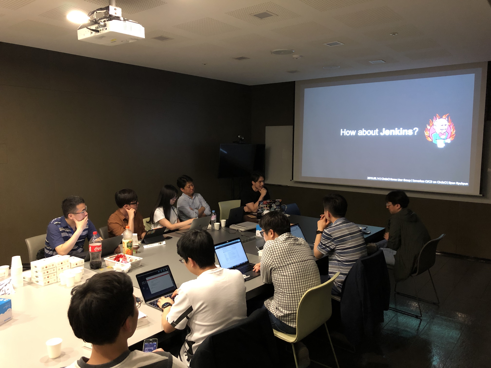

## 2019년 5월 15일
- 장소 : 넥슨 코리아
- 모임 시간 : 오후 7시 30분 ~ 9시 30분

### 발표 자료
- [Helm - Yaml 정글 탈출하기 - 장종호](https://www.dropbox.com/s/n868fu4xab9vvsl/Helm%EC%9C%BC%EB%A1%9C%20Yaml%EC%A0%95%EA%B8%80%20%ED%83%88%EC%B6%9C%ED%95%98%EA%B8%B0_20190515.pdf?dl=0)
    
- [CircleCI로 Serverless API의 CI/CD 환경 구축하기 - 변규현](https://www.slideshare.net/KyuhyunByun1/circleci-serverless-api-cicd)

### 소모임 공지
- 밋업 신청 시 참석자/대기자 구분해서 자리 배정해드리기가 어려워서 보통 20명 내외로 오시기 때문에 자리 배치 상관없이 자유롭게 참여하는 방향으로 진행하도록 하겠습니다.
- 다음 모임은 6월 5일(수요일) 입니다. 다음날 휴일이라서 소모임 이후 간단하게 맥주 한잔 하도록 하겠습니다. (남은 회비 사용 예정)
- 다음 모임에서 두 세션이 진행 됩니다.
    - 김동현님의 쿠버네티스 관련 세션 (제목 미정)
    - AWS 테크니컬 에반젤리스트 윤석찬님의 Q&A 세션
        - [미리 질문하기](http://bit.ly/2VxSn9A)

### 소모임 중 논의 내용
#### Helm - Yaml 정글 탈출하기

- 쿠버네티스로 마이크로 서비스 구현 시 관리해야할 yaml이 너무 많아짐 (yaml jungle)
- Helm은 yaml 파일들 관리를 위해 사용하고 helm chart를 사용하면 계층 구조로 yaml 파일 관리가 가능
- 업데이트 이력 관리에 용이
- Helm Client가 gRPC로 Tiller와 통신
    - Tiller는 쿠버네티스 클러스터에서 동작하는 Helm 서버
- Delete 하면 바로 삭제 되지 않고 리스트에서만 제거되어 롤백이 가능
    - purge를 해야 삭제됨
- 잘 만들어진 chart들이 이미 많이 존재하기 때문에 repository에서 검색해서 사용
- Helm은 빌드를 실행하여 yaml 파일을 생성하기 떄문에 템플릿 변수를 사용하여 동적으로 값을 할당할 수 있음
- helm hook을 사용하면 install/delete/update등의 명령 수행 중간에 스크립트를 실행할 수 있음
- 공식 사이트에 굉장히 많은 Plugin들이 있음
    - 개인적으로 diff plugin이 유용했음
        - 이전 버전과 변경된 부분을 한눈에 확인할 수 있음

#### Circle CI/CD

- Jenkins의 경우에는 JVM 기반으로 동작하기 때문에 메모리 문제 등의 이슈가 존재하고 Circle CI와 비교해서 설정이 복잡함
- Circle CI는 Script 기반이라서 개발자들에게 친숙함
- GUI 환경의 CI/CD를 지원하여 한눈에 진행 상황을 파악할 수 있음
- Web Socket이 연결되어 있어서 반응성이 좋음
- Android, iOS 빌드도 지원
    - 비용이 발생함
- 빌드 시간 1000분까지는 Free Tier이기 때문에 소규모 팀에서는 무료로 이용 가능

#### 참고
- [Helm 파이프라인을 GUI로 볼수 있는 codefresh](https://codefresh.io/)
- [모바일 앱 빌드에 사용하는 bitrise](https://www.bitrise.io/)

### 모임 사진

